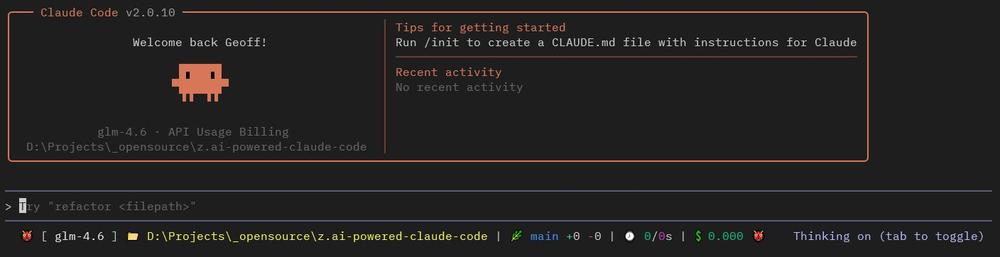

# Z.AI-Powered Claude Code



A set of wrapper scripts and configuration files to enable Claude Code to use Z.AI's GLM models, providing an alternative to Anthropic's native models with enhanced status line functionality.

## Overview

This project allows you to use Z.AI's GLM models (including GLM-4.6) with Claude Code by setting up the appropriate environment variables and configuration. It includes:

- **Wrapper scripts** for launching Claude Code with Z.AI models
- **Status line configuration** that displays model information, git branch, and usage statistics
- **Cross-platform support** for Windows, macOS, and Linux

## Prerequisites

1. **Claude Code** installed on your system
2. **jq** command-line JSON processor (required for parsing configuration)
   - Ubuntu/Debian: `sudo apt-get install jq`
   - macOS: `brew install jq`
   - Windows: `choco install jq` or `scoop install jq`
3. **Z.AI API key** and account

## Quick Start

The easiest way to get started is to use the automated installation script:

### Linux/macOS
```bash
bash scripts/install.sh
```

### Windows (PowerShell)
```powershell
.\scripts\install.ps1
```

### Windows (CMD)
```cmd
scripts\install.bat
```

The installer will:
- Detect and offer to upgrade existing installations
- Copy wrapper scripts to `~/.local/bin` (or `%USERPROFILE%\.local\bin` on Windows)
- Optionally add the directory to your PATH
- Optionally install Claude status line configuration
- Guide you through first-time configuration

After installation, simply run `z` to start the interactive configuration wizard. If you choose to store your API key as an environment variable, it will be set immediately in your current session—no need to restart your terminal!

## Configuration

### Environment Variables

The wrapper supports the following environment variables for enhanced security and flexibility:

- **`ZAI_API_KEY`**: Your Z.AI API key (highest priority, overrides config file)
- **`ZAI_CONFIG_PATH`**: Custom path to your configuration file
- **`XDG_CONFIG_HOME`**: XDG Base Directory for config files (Linux/macOS only)

#### Setting Environment Variables

**Linux/macOS (bash/zsh):**
```bash
export ZAI_API_KEY="your-api-key-here"
# Add to ~/.bashrc or ~/.zshrc to make permanent
```

**Windows (PowerShell):**
```powershell
# Temporary (current session only)
$env:ZAI_API_KEY = "your-api-key-here"

# Permanent (user-level)
[Environment]::SetEnvironmentVariable('ZAI_API_KEY', 'your-api-key-here', 'User')
```

**Windows (CMD):**
```cmd
rem Temporary (current session only)
set ZAI_API_KEY=your-api-key-here

rem Permanent (user-level)
setx ZAI_API_KEY "your-api-key-here"
```

### Configuration Files

The wrapper looks for configuration files in the following order (first found wins):

#### Linux/macOS
1. `./.zai.json` (per-project config, merged with global)
2. `$ZAI_CONFIG_PATH` (if set)
3. `$XDG_CONFIG_HOME/zai/config.json` (if XDG_CONFIG_HOME is set)
4. `~/.config/zai/config.json` (XDG default)
5. `~/.zai.json` (legacy location, backward compatible)

#### Windows
1. `.\.zai.json` (per-project config, merged with global)
2. `%ZAI_CONFIG_PATH%` (if set)
3. `%APPDATA%\zai\config.json`
4. `%USERPROFILE%\.zai.json` (legacy location, backward compatible)

### Configuration File Format

Configuration files use JSON format:

```json
{
  "apiKey": "your-api-key",
  "opusModel": "glm-4.6",
  "sonnetModel": "glm-4.5",
  "haikuModel": "glm-4.5-air",
  "subagentModel": "glm-4.6",
  "defaultModel": "opus",
  "enableThinking": "true",
  "enableStreaming": "true",
  "reasoningEffort": "high",
  "maxThinkingTokens": "",
  "maxOutputTokens": ""
}
```

### Configuration Options

- **apiKey**: Your Z.AI API key (can be omitted if using `ZAI_API_KEY` environment variable)
- **opusModel**: Model to use for opus tier requests (default: "glm-4.6")
- **sonnetModel**: Model to use for sonnet tier requests (default: "glm-4.5")
- **haikuModel**: Model to use for haiku tier requests (default: "glm-4.5-air")
- **subagentModel**: Model to use for subagent tasks and specialized agents (default: "glm-4.6")
- **defaultModel**: Default model to use when no model is specified (default: "opus")
- **enableThinking**: Enable AI thinking capabilities (default: "true")
- **enableStreaming**: Enable streaming responses (default: "true")
- **reasoningEffort**: Reasoning effort level - "auto", "low", "medium", "high", or "max" (default: "high")
- **maxThinkingTokens**: Maximum tokens for thinking (default: "")
- **maxOutputTokens**: Maximum tokens for output (default: "")

### Per-Project Configuration

You can create a `.zai.json` file in your project directory to override global settings:

```json
{
  "defaultModel": "sonnet",
  "reasoningEffort": "medium"
}
```

**Important:** Add `.zai.json` to your `.gitignore` if it contains your API key:
```gitignore
# Z.AI configuration (may contain API key)
.zai.json
```

### Configuration Priority

Settings are resolved in this order (highest priority first):

1. **API Key**: `ZAI_API_KEY` environment variable > config file `apiKey`
2. **Config Files**: Per-project `.zai.json` > global config file
3. **Config Locations**: Custom path > XDG/AppData > legacy home directory

### First-Time Setup

When you run `z` for the first time without a configuration file, an interactive setup wizard will guide you through:

1. Entering your Z.AI API key
2. Choosing where to store the configuration (user home or project directory)
3. Choosing how to store your API key (config file or environment variable)
4. Automatically setting up environment variables (if chosen)

The wizard creates a configuration file with secure permissions (chmod 600 on Unix systems).

## Manual Installation

If you prefer to install manually instead of using the automated installer:

### Linux/macOS

```bash
# Create directory
mkdir -p ~/.local/bin

# Copy wrapper script
cp bin/z ~/.local/bin/
chmod +x ~/.local/bin/z

# Add to PATH (add to ~/.bashrc or ~/.zshrc)
export PATH="$HOME/.local/bin:$PATH"

# Optional: Install status line
mkdir -p ~/.claude
cp claude/statusLine.sh ~/.claude/
chmod +x ~/.claude/statusLine.sh
cp claude/settings.json ~/.claude/  # or merge with existing
```

### Windows (PowerShell)

```powershell
# Create directory
New-Item -ItemType Directory -Path "$env:USERPROFILE\.local\bin" -Force

# Copy wrapper scripts
Copy-Item bin\z.cmd "$env:USERPROFILE\.local\bin\"
Copy-Item bin\z.ps1 "$env:USERPROFILE\.local\bin\"

# Add to PATH
$path = [Environment]::GetEnvironmentVariable("Path", "User")
[Environment]::SetEnvironmentVariable("Path", "$path;$env:USERPROFILE\.local\bin", "User")

# Optional: Install status line
New-Item -ItemType Directory -Path "$env:USERPROFILE\.claude" -Force
Copy-Item claude\statusLine.sh "$env:USERPROFILE\.claude\"
Copy-Item claude\settings.json "$env:USERPROFILE\.claude\"
```

### Windows (CMD)

```cmd
rem Create directory
mkdir %USERPROFILE%\.local\bin

rem Copy wrapper scripts
copy bin\z.cmd %USERPROFILE%\.local\bin\
copy bin\z.ps1 %USERPROFILE%\.local\bin\

rem Add to PATH
setx PATH "%PATH%;%USERPROFILE%\.local\bin"

rem Optional: Install status line
mkdir %USERPROFILE%\.claude
copy claude\statusLine.sh %USERPROFILE%\.claude\
copy claude\settings.json %USERPROFILE%\.claude\
```

## Upgrading

To upgrade to a new version of Z.AI wrapper:

1. Pull the latest changes from the repository (or download the new version)
2. Run the installation script again:

```bash
# Linux/macOS
bash scripts/install.sh

# Windows (PowerShell)
.\scripts\install.ps1

# Windows (CMD)
scripts\install.bat
```

The installer will detect your existing installation and offer to upgrade. Your configuration files will be preserved.

## Uninstallation

To remove the Z.AI wrapper:

### Linux/macOS
```bash
bash scripts/uninstall.sh
```

### Windows (PowerShell)
```powershell
.\scripts\uninstall.ps1
```

### Windows (CMD)
```cmd
scripts\uninstall.bat
```

The uninstaller will prompt you to:
- Remove wrapper scripts
- Remove Claude status line configuration
- Clean up PATH entries (Linux/macOS only - Windows requires manual cleanup)
- Remove configuration files
- Remove environment variables

## Usage

Once installed, use the `z` command instead of `claude`:

```bash
# First run - interactive configuration wizard
z

# Start a new session with the default model
z

# Use a specific model
z --model sonnet
z --model haiku

# Pass any other claude arguments
z --model opus "Help me write a Python script"
z --help
```

### Using Different Models

The wrapper maps Claude model tiers to Z.AI models:

- **opus** → `glm-4.6` (configurable via `opusModel`)
- **sonnet** → `glm-4.5` (configurable via `sonnetModel`)
- **haiku** → `glm-4.5-air` (configurable via `haikuModel`)

Set a default model in your configuration:
```json
{
  "defaultModel": "sonnet"
}
```

### AI Thinking Capabilities

Configure AI thinking through your configuration file:

```json
{
  "enableThinking": "true",
  "enableStreaming": "true",
  "reasoningEffort": "high",
  "maxThinkingTokens": "",
  "maxOutputTokens": ""
}
```

**Note:** These features are experimental and may not be fully supported by the Z.AI API. The `reasoningEffort` option supports values: "auto", "low", "medium", "high", or "max". These settings are passed through to the API, but actual behavior depends on the API's implementation.

## Status Line Features

The status line displays:

- **Model indicator**: 👾 for Claude models, 👹 for Z.AI models
- **Model name**: Currently active model
- **Current directory**: The directory you're working in
- **Git branch**: Current git branch (if in a git repository)
- **Code changes**: Lines added/removed in the session
- **Timing**: API duration and total session time
- **Cost**: Total cost of the session in USD

**Note:** The status line requires bash and proper stdin piping support. On Windows, it **only works reliably with Git Bash** (`z`). It does not work with Windows CMD (`z.cmd`) or PowerShell (`z.ps1`) due to stdin piping limitations when Claude Code invokes external commands.

## Platform-Specific Notes

### Windows
- Three scripts are provided: `z.cmd` (Command Prompt), `z.ps1` (PowerShell), and `z` (Git Bash)
- The scripts automatically detect the Windows user profile directory
- Requires `jq` to be installed and available in PATH
- **Status line limitation:** The status line **only works with Git Bash** (`z`). It does not work with CMD (`z.cmd`) or PowerShell (`z.ps1`) due to stdin piping limitations. Use Git Bash for the full experience including status line

### macOS/Linux
- The `z` script works with bash and other POSIX-compliant shells
- Uses standard Unix paths and environment variables

## Troubleshooting

### Configuration Issues

**"Valid API key not found" error:**
- Set the `ZAI_API_KEY` environment variable, or
- Ensure your config file contains a valid `apiKey` (not "your-api-key")
- Check config file locations (see Configuration section)

**"Configuration file not found" error:**
- Run `z` to start the interactive configuration wizard
- Or manually create a config file in one of the supported locations

**Permission warnings (Unix):**
- The wrapper warns if config files have overly permissive permissions
- Fix with: `chmod 600 ~/.config/zai/config.json`

### Installation Issues

**"jq not found" error:**
- Install `jq` using your system package manager:
  - Ubuntu/Debian: `sudo apt-get install jq`
  - macOS: `brew install jq`
  - Windows: `choco install jq` or `scoop install jq`

**Command not found: z**
- Ensure `~/.local/bin` is in your PATH
- Restart your terminal after installation
- Check installation with: `which z` (Unix) or `where z` (Windows)

### Status Line Issues

**Status line not showing:**
- Verify `~/.claude/settings.json` contains the statusLine configuration
- Ensure `statusLine.sh` is executable: `chmod +x ~/.claude/statusLine.sh`
- Ensure bash is installed and in your PATH (on Windows, install Git for Windows)
- **Windows users:** The status line **only works when running from Git Bash** (`z`). It does not work with CMD (`z.cmd`) or PowerShell (`z.ps1`) due to stdin piping limitations when Claude Code invokes external commands. Use Git Bash for the full experience

### Per-Project Configuration

**Project config not being used:**
- Ensure `.zai.json` is in the current working directory
- Check file permissions (must be readable)
- Project config merges with (doesn't replace) global config

### Environment Variables

**Environment variable not persisting:**
- Use `setx` on Windows CMD (not `set`)
- Use `[Environment]::SetEnvironmentVariable()` in PowerShell
- Add `export` to shell profile on Linux/macOS (~/.bashrc, ~/.zshrc)
- Restart terminal after setting environment variables

## License

This project is licensed under the MIT License - see the [LICENSE](LICENSE) file for details.

## Contributing

Contributions are welcome! Please feel free to submit a Pull Request.

## Additional Documentation

- **[INSTALL.md](INSTALL.md)**: Comprehensive installation guide with troubleshooting
- **[CONFIGURATION.md](CONFIGURATION.md)**: Detailed configuration reference and examples
- **[CONFIG_EXAMPLE.md](CONFIG_EXAMPLE.md)**: Annotated configuration file examples

## Security Best Practices

1. **Use environment variables for API keys** instead of storing in config files
2. **Add `.zai.json` to `.gitignore`** in your projects
3. **Set restrictive permissions** on config files (chmod 600 on Unix)
4. **Never commit API keys** to version control
5. **Use per-project configs** without API keys, relying on global config or env vars

## Support

For issues related to:
- **Z.AI API**: Contact Z.AI support
- **Claude Code**: Refer to Anthropic's documentation
- **This wrapper**: Create an issue in the project repository